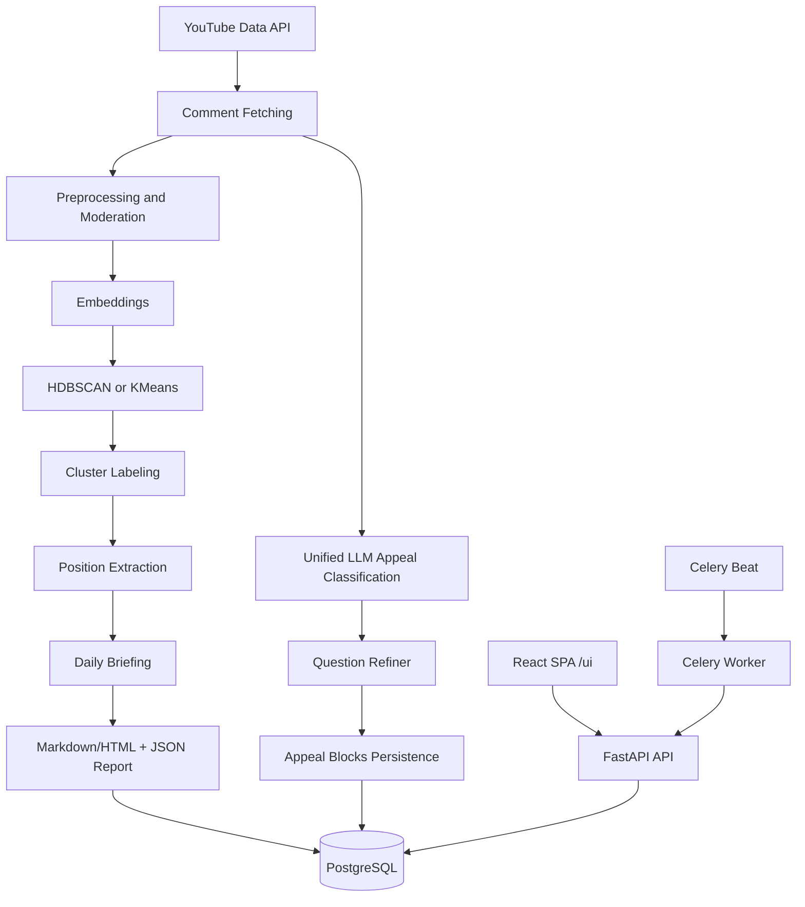

# YouTubeAnalyzer

Production-ready platform for analyzing YouTube comments with two independent pipelines:

1. **Topic Intelligence Pipeline**: semantic clustering, position extraction, and editorial briefings.
2. **Appeal Analytics Pipeline**: targeted classification of author-directed comments.

The backend is built with FastAPI + Celery + PostgreSQL, and the UI is a React SPA served from `/ui`.

## Why This Project

YouTube comment streams are large, noisy, and hard to operationalize manually. This system converts raw comments into:

- structured themes and positions,
- actionable recommendations for the next episode,
- author-focused risk and feedback signals,
- stable artifacts in DB and Markdown/HTML reports.

## Two Pipelines

## 1) Topic Intelligence Pipeline

Purpose: full semantic understanding of the discussion around a video.

Flow (11 stages):

1. `context` - loads previous report context (comment-only context model).
2. `comments_fetch` - fetches comments via YouTube Data API (hybrid time + relevance).
3. `preprocess` - normalization, filtering, rule moderation, optional LLM borderline moderation.
4. `comments_persist` - persists processed comments.
5. `embeddings` - generates embeddings (local SentenceTransformer or OpenAI).
6. `clustering` - HDBSCAN with adaptive parameters and KMeans fallbacks.
7. `episode_match` - compatibility stage, explicitly skipped.
8. `labeling` - OpenAI cluster labeling + position extraction.
9. `clusters_persist` - saves clusters and cluster members.
10. `briefing` - composes structured daily briefing.
11. `report_export` - writes Markdown/HTML + diagnostics and stores report JSON in DB.

Main entry point:

- `app/services/pipeline/runner.py` (`DailyRunService`)

## 2) Appeal Analytics Pipeline

Purpose: extract comments explicitly relevant to the author and classify them into 4 mutually exclusive blocks.

Flow (3 stages):

1. `Loading comments` - loads comments for the video (reuses persisted comments, fetches when needed).
2. `LLM classification` - single-pass LLM classification into:
   - `constructive_criticism`
   - `constructive_question` (followed by Question Refiner second pass)
   - `author_appeal`
   - `toxic`
   - `skip` (not persisted as a block)
   Priority at overlap: `question > criticism > appeal > toxic > skip`.
   Comments clipped using head+tail strategy: first ~110 words + `[...]` + last ~40 words,
   ensuring trailing questions are always visible to the LLM.
   If LLM returns partial JSON (omits some comment numbers), missing entries are automatically
   covered by heuristic regex fallback — no comment is silently dropped.
3. `Persisting results` - persists `appeal_runs`, `appeal_blocks`, `appeal_block_items`.
   `constructive_question` items store refiner enrichment fields in `detail_json`.

Main entry point:

- `app/services/appeal_analytics/runner.py` (`AppealAnalyticsService`)

## Architecture



## API Surface

All routes are implemented in `app/api/routes.py`.

### Core + Reports

| Method | Path | Description |
|---|---|---|
| `GET` | `/health` | Health snapshot and OpenAI endpoint mode |
| `POST` | `/run/latest` | Trigger Topic Intelligence for latest playlist video |
| `POST` | `/run/video` | Trigger Topic Intelligence for a specific video URL |
| `GET` | `/videos` | List videos and report availability |
| `GET` | `/videos/statuses` | Detailed per-video run status and progress |
| `GET` | `/videos/{video_id}` | Video metadata by YouTube ID |
| `GET` | `/reports/latest` | Latest report |
| `GET` | `/reports/{video_id}` | Latest report for a video |
| `GET` | `/reports/{video_id}/detail` | Report enriched with topic comments and positions |

### Appeal Analytics

| Method | Path | Description |
|---|---|---|
| `POST` | `/appeal/run` | Trigger Appeal Analytics (latest or specific URL) |
| `GET` | `/appeal/{video_id}` | Read latest completed appeal analytics result |
| `GET` | `/appeal/{video_id}/author/{author_name}` | Get all comments by one author under that video |

### Runtime and Budget

| Method | Path | Description |
|---|---|---|
| `GET` | `/budget` | Daily OpenAI usage snapshot from DB |
| `GET` | `/settings/runtime` | Get mutable runtime settings |
| `PUT` | `/settings/runtime` | Update mutable runtime settings |

### UI

| Method | Path | Description |
|---|---|---|
| `GET` | `/` | Redirect to `/ui` |
| `GET` | `/ui` and `/ui/{path}` | Serve React SPA |

## Runtime Notes (Important)

- **Video transcription is removed from active execution path.**
  - Stage `episode_match` is kept for compatibility but marked as skipped.
  - Transcript-related config fields exist for backward compatibility and are not used in the current runtime flow.
- **Budget and call quota blockers are currently disabled by design.**
  - Usage is still tracked in `budget_usage` and exposed via `/budget`.
  - This build monitors cost but does not hard-stop calls.
- **OpenAI is required for both pipelines.**
  - Cluster labeling and appeal classification rely on `OpenAIChatProvider`.

## Tech Stack

- Backend: FastAPI, SQLAlchemy 2, Pydantic v2, Alembic
- Async: Celery + Redis
- DB: PostgreSQL
- NLP/ML: sentence-transformers, HDBSCAN, scikit-learn
- LLM: OpenAI Python SDK
- Frontend: React 18, TypeScript, Vite, React Router

## Project Layout

```text
.
|- app/
|  |- api/                      # FastAPI routes and dependencies
|  |- core/                     # Settings, logging, exceptions, helpers
|  |- db/                       # SQLAlchemy models and sessions
|  |- schemas/                  # API and domain schemas
|  |- services/
|  |  |- pipeline/              # Topic Intelligence pipeline modules
|  |  `- appeal_analytics/      # Appeal Analytics pipeline modules
|  |- workers/                  # Celery app and tasks
|  `- main.py                   # FastAPI app entry point
|- frontend/                    # React SPA
|- alembic/                     # DB migrations
|- scripts/                     # Container start scripts
|- tests/                       # pytest suite
|- docker-compose.yml
`- PIPELINE.md                  # Detailed pipeline documentation
```

## Quick Start (Docker)

```bash
cp .env-docker.example .env-docker
# Fill at least: YOUTUBE_API_KEY, YOUTUBE_PLAYLIST_ID, OPENAI_API_KEY
docker compose up --build
```

Services:

- UI: `http://localhost:8000/ui`
- API docs: `http://localhost:8000/docs`
- Health: `http://localhost:8000/health`

## Local Development

```bash
cp .env.example .env
# Fill at least: YOUTUBE_API_KEY, YOUTUBE_PLAYLIST_ID, OPENAI_API_KEY

python -m venv .venv
# Windows PowerShell:
# .\.venv\Scripts\Activate.ps1
# Linux/macOS:
# source .venv/bin/activate

pip install -U pip
pip install -r requirements.txt

docker compose up -d db redis
alembic upgrade head

uvicorn app.main:app --host 0.0.0.0 --port 8000 --reload
celery -A app.workers.celery_app:celery_app worker --loglevel=INFO
celery -A app.workers.celery_app:celery_app beat --loglevel=INFO

npm --prefix frontend install
npm --prefix frontend run build
```

## Minimal Required Environment

| Variable | Required | Notes |
|---|---|---|
| `YOUTUBE_API_KEY` | Yes | YouTube Data API key |
| `YOUTUBE_PLAYLIST_ID` | Yes | Used by latest-video runs |
| `OPENAI_API_KEY` | Yes | Required for both pipelines |
| `DATABASE_URL` | Yes | PostgreSQL DSN |
| `CELERY_BROKER_URL` | Yes | Redis broker |
| `CELERY_RESULT_BACKEND` | Yes | Redis result backend |

Full config reference is in `.env.example` (local) and `.env-docker.example` (Docker).

## Testing and Quality

```bash
pytest
ruff check .
black .
mypy app
```

## License

This repository is **not open source**.

See [LICENSE](LICENSE) for terms.
