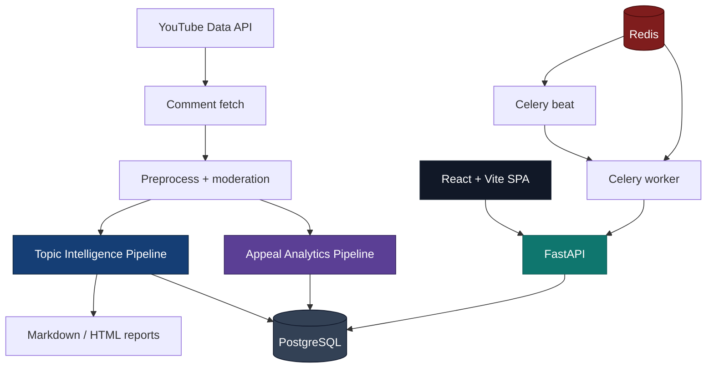
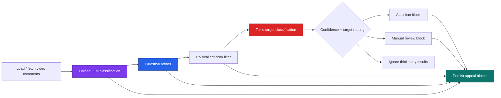

<div align="center">

# YouTube Intel

### From raw YouTube comments to **themes, audience positions, editorial briefings, and moderation-ready creator signals**

[](https://python.org)
[](https://fastapi.tiangolo.com)
[](https://react.dev)
[](https://postgresql.org)
[](https://redis.io)
[](https://openai.com)

<br />

**YouTube Intel** is a portfolio-grade, production-style analytics platform that treats YouTube comments as operational data — not just sentiment fluff.

It combines a full-stack product surface with two substantial pipelines:
- a **Topic Intelligence Pipeline** for clustering, labeling, briefing, and audience positions;
- an **Appeal Analytics Pipeline** for criticism, questions, appeals, toxicity, and moderation support.

[🚀 Quick Start](#-quick-start) · [🏗 Architecture](#-architecture) · [🔬 Topic Pipeline](#-topic-intelligence-pipeline) · [🎯 Appeal Pipeline](#-appeal-analytics-pipeline) · [📡 API](#-api-reference)

> If this project makes you think **“this should have more stars”** — you’re probably right ⭐

</div>

---

## The pitch

Most YouTube analytics tools stop at vanity metrics.

They tell you:
- views,
- engagement,
- rough sentiment,
- maybe some keyword clouds.

They usually **do not** tell you:
- what the audience is *actually arguing about*;
- which positions exist inside each topic;
- what comments are actionable for the next episode;
- what criticism is genuinely constructive;
- which toxic messages should be reviewed or escalated.

**YouTube Intel** is built to solve exactly that.

<table>
<tr>
<td width="50%">

### 🔬 Semantic topic intelligence
Reveal real audience themes, cluster structure, representative quotes, and position-level disagreement.

</td>
<td width="50%">

### 🎯 Creator-facing signal extraction
Separate criticism, questions, appeals, and toxicity instead of mixing everything into one noisy bucket.

</td>
</tr>
<tr>
<td width="50%">

### 🛡 Moderation-aware workflow
Support toxic review queues, target detection, and manual/automatic moderation actions.

</td>
<td width="50%">

### 📦 Exportable decision artifacts
Persist reports and analytics blocks in PostgreSQL and export Markdown/HTML reporting artifacts.

</td>
</tr>
</table>

---

## Why this repo is worth starring

<table>
<tr>
<td width="33%">

### 🧠 Real pipeline depth
Not a toy CRUD app. This repo includes clustering, embeddings, LLM classification, refinement passes, moderation logic, diagnostics, and background execution.

</td>
<td width="33%">

### 🖥 Full product surface
Backend, frontend, API docs, Docker deployment, Celery workers, runtime settings, operator dashboard, and a desktop packaging companion.

</td>
<td width="33%">

### 🧰 Portfolio + practical utility
Designed to look strong on GitHub **and** to behave like a credible internal analytics product.

</td>
</tr>
</table>

---

## ✨ What the product does today

### Core capabilities
- **Topic Intelligence Pipeline** for semantic clustering, topic labeling, audience-position extraction, and daily briefing generation
- **Appeal Analytics Pipeline** for author-directed criticism, questions, appeals, and toxicity routing
- **Hybrid moderation** with rule-based filtering, optional LLM borderline moderation, toxic target detection, and review queues
- **Operator UI** for runs, reports, runtime settings, budget visibility, and appeal review
- **Asynchronous processing** via Celery + Redis
- **Docker-first environment** with PostgreSQL, Redis, backend, worker, and beat
- **Desktop companion** in [`desktop/`](./desktop) for local packaged delivery

### Operator-facing routes
- `/ui` — dashboard shell
- `/ui/videos` — recent videos + status monitor
- `/ui/budget` — budget + runtime settings
- `/ui/reports/:videoId` — full topic report detail
- `/ui/appeal/:videoId` — appeal analytics + toxic moderation workflow
- `/docs` — Swagger UI

---

## 🏗 Architecture



### Stack overview
| Layer | Technology |
|---|---|
| API layer | FastAPI |
| Persistence | SQLAlchemy + PostgreSQL |
| Background execution | Celery + Redis |
| ML / NLP | SentenceTransformers, HDBSCAN, scikit-learn |
| LLM layer | OpenAI-compatible chat + embeddings |
| Frontend | React 18, TypeScript, Vite |
| Desktop packaging companion | [`desktop/`](./desktop) |

---

## 🔬 Topic Intelligence Pipeline

> **Entry point:** `app/services/pipeline/runner.py` → `DailyRunService`

This is the “what is the audience discussing, how are they split, and what should the creator do next?” pipeline.


### What happens in each stage
| # | Stage | What it does |
|:-:|---|---|
| 1 | Context | Loads prior report context for continuity |
| 2 | Comments fetch | Pulls comments via the YouTube Data API |
| 3 | Preprocess + moderation | Filters low-signal items, normalizes text, applies rule-based moderation, optionally runs borderline LLM moderation |
| 4 | Persist comments | Stores processed comments in PostgreSQL |
| 5 | Embeddings | Builds vectors with local embeddings or OpenAI |
| 6 | Clustering | Groups comments into themes with fallback logic for edge cases |
| 7 | Episode match | Preserved as a compatibility stage and **explicitly skipped** in the active runtime |
| 8 | Labeling + audience positions | Produces titles, summaries, and intra-topic positions |
| 9 | Persist clusters | Saves clusters and membership mappings |
| 10 | Briefing build | Generates executive summary, actions, risks, and topic-level findings |
| 11 | Report export | Writes Markdown/HTML reports and stores structured JSON |

### Main outputs
- top themes by discussion weight
- representative quotes and question comments
- audience positions inside each theme
- editorial briefing for the next content cycle, including actions, misunderstandings, audience requests, risks, and trend deltas
- moderation and degradation diagnostics

---

## 🎯 Appeal Analytics Pipeline

> **Entry point:** `app/services/appeal_analytics/runner.py` → `AppealAnalyticsService`

This is the “what is being said *to the creator*?” pipeline.



### Persisted blocks
| Block | Meaning |
|---|---|
| `constructive_question` | creator-directed questions |
| `constructive_criticism` | criticism backed by an actual political argument |
| `author_appeal` | direct requests / appeals to the creator |
| `toxic_auto_banned` | toxic comments that passed final verification and were auto-moderated |
| `toxic_manual_review` | toxic comments queued for admin review |

`skip` is still used internally as a classification outcome, but it is **not persisted as a block**.

### Pipeline behaviors that matter
- question candidates get a **second-pass refiner**;
- criticism with question signal can be promoted into the question block;
- low-value `attack_ragebait` / `meme_one_liner` question candidates are demoted out of `constructive_question`;
- toxic comments are classified by **target** (`author`, `guest`, `content`, `undefined`, `third_party`);
- routing splits comments into **auto-ban**, **manual review**, or **ignore**;
- comments with toxicity confidence **>= 0.80** enter the auto-ban path, but a final strict verification pass can still downgrade them into manual review;
- auto-banned authors can be **unbanned from the UI** if the operator spots a false positive;
- per-video guest names can improve targeting accuracy.

---

## 📡 API Reference

Interactive docs live at **`/docs`** when the backend is running.

### Core runs and reports
| Method | Endpoint | Purpose |
|:---:|---|---|
| `GET` | `/health` | health and OpenAI endpoint metadata |
| `POST` | `/run/latest` | run Topic Intelligence for the latest playlist video |
| `POST` | `/run/video` | run Topic Intelligence for a specific video URL |
| `GET` | `/videos` | recent videos |
| `GET` | `/videos/statuses` | progress/status dashboard payload |
| `GET` | `/videos/{video_id}` | single-video metadata |
| `GET` | `/reports/latest` | latest report |
| `GET` | `/reports/{video_id}` | latest report for one video |
| `GET` | `/reports/{video_id}/detail` | enriched report with comments and positions |

### Appeal analytics and moderation
| Method | Endpoint | Purpose |
|:---:|---|---|
| `POST` | `/appeal/run` | run Appeal Analytics |
| `GET` | `/appeal/{video_id}` | latest appeal analytics result |
| `GET` | `/appeal/{video_id}/author/{author_name}` | all comments by one author |
| `GET` | `/appeal/{video_id}/toxic-review` | manual toxic-review queue |
| `POST` | `/appeal/ban-user` | manual ban action |
| `POST` | `/appeal/unban-user` | restore a previously banned commenter |

### Runtime and settings
| Method | Endpoint | Purpose |
|:---:|---|---|
| `GET` | `/settings/video-guests/{video_id}` | load guest names |
| `PUT` | `/settings/video-guests/{video_id}` | update guest names |
| `GET` | `/budget` | OpenAI usage snapshot |
| `GET` | `/settings/runtime` | current mutable runtime settings |
| `PUT` | `/settings/runtime` | update mutable runtime settings |
| `GET` | `/app/setup/status` | desktop-only first-run setup status |
| `POST` | `/app/setup` | desktop-only save desktop bootstrap secrets |
| `PUT` | `/app/setup` | desktop-only rotate desktop bootstrap secrets / OAuth values |

For request examples, see [`requests.md`](./requests.md).

---

## 🚀 Quick Start

### Docker Compose
```bash
cp .env-docker.example .env-docker
# fill in YOUTUBE_API_KEY, YOUTUBE_PLAYLIST_ID, OPENAI_API_KEY

docker compose up --build
```

Services started:
- PostgreSQL
- Redis
- FastAPI backend
- Celery worker
- Celery beat

App URLs:
- UI: `http://localhost:8000/ui`
- Swagger: `http://localhost:8000/docs`
- Health: `http://localhost:8000/health`

### Local development
```bash
cp .env.example .env
python -m venv .venv
source .venv/bin/activate        # Linux/macOS
# .\.venv\Scripts\Activate.ps1   # Windows PowerShell

pip install -U pip
pip install -r requirements-dev.txt

docker compose up -d db redis
alembic upgrade head

uvicorn app.main:app --reload
```

Frontend in a separate terminal:
```bash
npm --prefix frontend ci
npm --prefix frontend run dev
```

Workers in separate terminals:
```bash
celery -A app.workers.celery_app:celery_app worker --loglevel=INFO
celery -A app.workers.celery_app:celery_app beat --loglevel=INFO
```

---

## ⚙️ Configuration

Primary configuration surfaces:
- [`.env.example`](./.env.example)
- [`.env-docker.example`](./.env-docker.example)
- [`app/core/config.py`](./app/core/config.py)

### Most important variables
| Variable | Why it matters |
|---|---|
| `YOUTUBE_API_KEY` | YouTube Data API access |
| `YOUTUBE_PLAYLIST_ID` | latest-video runs |
| `OPENAI_API_KEY` | classification, labeling, moderation |
| `YOUTUBE_OAUTH_CLIENT_ID` | optional YouTube moderation / restore actions |
| `YOUTUBE_OAUTH_CLIENT_SECRET` | optional YouTube moderation / restore actions |
| `YOUTUBE_OAUTH_REFRESH_TOKEN` | optional YouTube moderation / restore actions |
| `DATABASE_URL` | PostgreSQL persistence |
| `CELERY_BROKER_URL` | Redis broker |
| `CELERY_RESULT_BACKEND` | Redis result storage |
| `EMBEDDING_MODE` | `local` or `openai` |
| `LOCAL_EMBEDDING_MODEL` | recommended local topic-clustering model |

### Runtime notes
- `episode_match` / transcription fields still exist for compatibility, but that stage is **skipped in the active runtime**.
- budget usage is tracked and visible via UI/API;
- guest-name configuration improves appeal/toxic targeting quality.
- for historical A/B testing of local embedding models, run `PYTHONPATH=. python scripts/benchmark_topic_models.py`.

---

## 🛠 Quality Gates

Recommended checks:

```bash
ruff check .
black --check .
pytest -q
npm --prefix frontend run build
```

CI in `.github/workflows/ci.yml` covers:
- Python lint / formatting
- pytest
- frontend production build

---

## 📂 Project Structure

```text
app/                 FastAPI app, schemas, services, workers
frontend/            React SPA
alembic/             database migrations
tests/               pytest suite
scripts/             startup scripts for api/worker/beat
desktop/             desktop packaging companion
PIPELINE.md          pipeline-level notes
requests.md          endpoint request reference
```

### Helpful companion docs
- [`PIPELINE.md`](./PIPELINE.md)
- [`requests.md`](./requests.md)
- [`app/README.md`](./app/README.md)
- [`frontend/README.md`](./frontend/README.md)
- [`tests/README.md`](./tests/README.md)
- [`desktop/README.md`](./desktop/README.md)

---

## Final note

This repo is deliberately built to feel like **a serious internal analytics product**, not just a demo.

If you like projects that combine:
- real product thinking,
- non-trivial data/LLM pipelines,
- backend + frontend + infra,
- and a strong GitHub presentation,

**YouTube Intel was made for that exact intersection.**

---

## License

See [`LICENSE`](./LICENSE).
